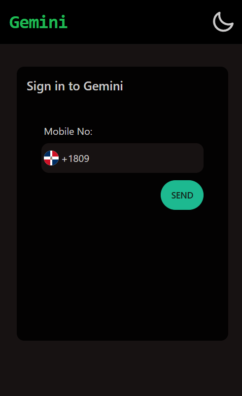

# 💬 Gemini Chat – AI Conversational App

A Gemini-style conversational AI chat app built with React, Zustand, and Tailwind CSS. Users can sign in with OTP, manage chatrooms, and chat with an AI bot. Built with a focus on clean UX, responsiveness, and simulated AI experience.

---

## 🚀 Features

### ✅ 1. Authentication

- OTP-based login/signup with country code picker
- Country data fetched from **restcountries.com**
- OTP is simulated using `setTimeout`
- Form validation using **React Hook Form** + **Zod**

### ✅ 2. Dashboard

- View all your chatrooms
- Create and delete chatrooms
- Toast notifications for feedback

### ✅ 3. Chatroom Interface

- Responsive, clean chat UI
- AI and user messages with timestamps
- Typing indicator (`Gemini is typing...`)
- Auto-scroll to the latest message
- Infinite scroll with client-side pagination (20 messages per page)
- Image upload support (Base64 preview)
- Simulated AI response with delay + throttling

### ✅ 4. Global UX

- Dark/light theme toggle
- Mobile-first responsive design
- Persistent data using `localStorage`
- Toasts for key interactions

---

## 🛠️ Tech Stack

- **Framework**: React (Vite)
- **State Management**: Zustand
- **Form Handling**: React Hook Form + Zod
- **Styling**: Tailwind CSS + DaisyUI
- **Notifications**: React Hot Toast

---

## 🔗 Live Preview

👉 [Live App](https://gemini-clone-a.netlify.app)  
👉 [GitHub Repo](https://github.com/shoeb145/Gemini_Clone)

---

## 📸 Screenshots

